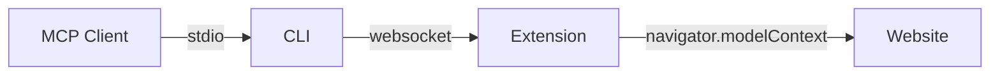

Use tools from any website in any MCP client.

`webmcp-bridge` is a CLI and Chrome extension that bridge `navigator.modelContext` (Chrome 146+) to MCP over stdio. The extension intercepts WebMCP tool registrations from open tabs and forwards them over a localhost WebSocket to the CLI, which exposes them as standard MCP tools.



## Why WebMCP?

Websites already orchestrate APIs, manage auth, and handle complex workflows. A traditional MCP server rebuilds all of that from scratch. WebMCP skips it — the website registers tools client-side via `navigator.modelContext`, and agents call them through the browser. The tools run through the same code paths as the UI, authenticated by whatever the user already has.

|                | Traditional MCP         | WebMCP             |
| -------------- | ----------------------- | ------------------ |
| Server         | build and host          | the website        |
| Auth           | API keys, token refresh | browser sessions   |
| Business logic | reimplement             | already in the UI  |
| Maintenance    | track API changes       | website handles it |

### What this extension adds

WebMCP alone only talks to the browser's built-in agent. This extension bridges it to the MCP ecosystem — Claude, Cursor, Windsurf, any MCP client can call tools from any open tab.

## Quick Start

```bash
npm install -g webmcp-bridge
```

Load the extension: `chrome://extensions` → Developer mode → Load unpacked → `extension/`

Add to your MCP client:

```json
{
  "mcpServers": {
    "webmcp": {
      "command": "webmcp-bridge"
    }
  }
}
```

Open a [WebMCP-enabled site](https://googlechromelabs.github.io/webmcp-tools/demos/react-flightsearch/). Extension badge goes green. Tools appear in your client.

## Development

```bash
bun install       # deps
bun test          # unit tests
bun run test:e2e  # end-to-end
bun run dev       # dev mode
bun run build     # build for npm
bun run lint      # typecheck
```

## Security

Localhost-only (`127.0.0.1`), random port (13100-13199), 256-bit shared secret, origin-validated, nonce-protected, 0700/0600 file perms. Details in `CLAUDE.md`.

## License

MIT
